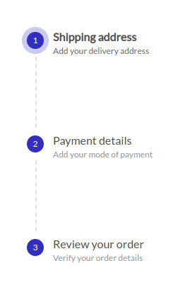
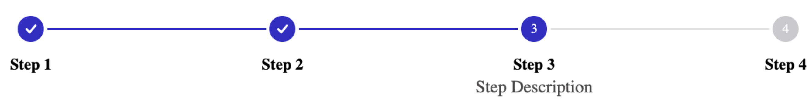

# React Stepper

<a href="https://www.npmjs.com/package/@keyvaluesystems/react-vertical-stepper"></a> <a href="https://www.npmjs.com/package/@keyvaluesystems/react-vertical-stepper" ></a> <a href="https://github.com/KeyValueSoftwareSystems/react-vertical-stepper"></a>

<div style="display: flex; align-items: center;">
<div style="padding-left: 30px">

</div>
<div style="padding-left: 30px">

</div>
</div>
A fully customizable ready to use stepper UI package for React.
Try tweaking a stepper using this codesandbox link <a href="https://codesandbox.io/p/sandbox/react-stepper-zp2jrs?file=%2Fsrc%2FApp.js" >here</a>

## Installation

The easiest way to use react-stepper-ui-component is to install it from npm and build it into your app with Webpack.

```bash
npm install  @keyvaluesystems/react-stepper
```

You’ll need to install React separately since it isn't included in the package.

## Usage

React Stepper can run in a very basic mode by just providing the `steps` and `currentStepIndex` props like this:

```jsx
<Stepper
  steps={[
    {
      label: "Step 1",
      description: "This is Step 1",
      completed: true,
    },
    {
      label: "Step 2",
      description: "This is Step 2",
      completed: false,
    },
    {
      label: "Step 3",
      description: "This is Step 3",
      completed: false,
    },
  ]}
  currentStepIndex={1}
/>
```

The `steps` array is an array of objects with following keys:

- `label` - A mandatory string representing the label/title of the step.
- `description` - Optional extra information or description for the step.
- `completed` -  Boolean flag for indicating step completion status.

You can customize each step node  with your own DOM element using the `renderNode` prop

```jsx
<Stepper
  steps={stepsArray}
  currentStepIndex={currentStepIndex}
  renderNode={(step, stepIndex) => <div key={stepIndex}>{step.label}</div>}
/>
```

The `step` param provided by the `renderBubble` callback is the same object you pass as array item in `steps` prop.

## Props

Props that can be passed to the component are listed below:

<table>
  <thead>
    <tr>
      <th>Prop</th>
      <th>Description</th>
      <th>Default</th>
    </tr>
  </thead>
  <tbody>
    <tr>
      <td><code><b>steps:</b> object[]</code></td>
      <td>An array of step objects to render.</td>
      <td><code>undefined</code></td>
    </tr>
    <tr>
      <td><code><b>currentStepIndex:</b> number</code></td>
      <td>The index of current active step.</td>
      <td><code>0</code></td>
    </tr>
    <tr>
      <td><code><b>onStepClick?:</b> (step: object, stepIndex: number): void</code></td>
      <td>
        A step click handler that fires each time you click on a step.
      </td>
      <td><code>undefined</code></td>
    </tr>
    <tr>
      <td><code><b>renderNode?:</b> (step: object, stepIndex: number): ReactElement</code></td>
      <td>
        A render function to customize each step node with your own element.
      </td>
      <td><code>undefined</code></td>
    </tr>
    <tr>
      <td><code><b>orientation?:</b> 'horizontal' | 'vertical'</code></td>
      <td>
        Determines the layout of the stepper.
      </td>
      <td><code>vertical</code></td>
    </tr>
    <tr>
      <td><code><b>labelPosition?:</b> 'left' | 'right' | 'top' | 'bottom'</code></td>
      <td>
        Allows you to align step label and description with respect to its node
      </td>
      <td><code>right</code></td>
    </tr>
    <tr>
      <td><code><b>showDescriptionsForAllSteps</b> boolean</code></td>
      <td>
        A boolean prop specifying whether to show descriptions for all steps within the stepper.
      </td>
      <td><code>false</code></td>
    </tr>
    <tr>
      <td><code><b>stepContent</b>(step: object, stepIndex: number): ReactElement</code></td>
      <td>
        Props that allows for dynamic content display when the step is active
      </td>
      <td><code>undefined</code></td>
    </tr>
    <tr>
      <td><code><b>styles?:</b> object</code></td>
      <td>
        Provides you with a bunch of callback functions to override the default styles.
      </td>
      <td><code>undefined</code></td>
    </tr>
  </tbody>
</table>

## Style Customizations

All the default styles provided by this package can be overridden using the `style` prop
the below code shows all the styles that can be overridden:

```jsx
import React from "react";
import Stepper from "react-vertical-stepper";

function App() {
  const stylesOverride = {
    LabelTitle: (step, stepIndex) => ({ ...styles }),
    ActiveLabelTitle: (step, stepIndex) => ({ ...styles }),
    LabelDescription: (step, stepIndex) => ({ ...styles }),
    ActiveLabelDescription: (step, stepIndex) => ({ ...styles }),
    LineSeparator: (step, stepIndex) => ({ ...styles }),
    InactiveLineSeparator: (step, stepIndex) => ({ ...styles }),
    Bubble: (step, stepIndex) => ({ ...styles }),
    ActiveBubble: (step, stepIndex) => ({ ...styles }),
    InActiveBubble: (step, stepIndex) => ({ ...styles }),
  };
  return (
    <Stepper
      steps={stepsArray}
      currentStepIndex={currentStepIndex}
      styles={stylesOverride}
    />
  );
}

export default App;
```

- `LabelTitle` - overrides the step label style
- `ActiveLabelTitle` - overrides the step label style of current active step
- `LabelDescription` - overrides the step description style
- `ActiveLabelDescription` - overrides the step description style of current active step
- `LineSeparator` - overrides default step connector line styles
- `InactiveLineSeparator` - overrides styles of step connector line after current active step
- `Bubble` - overrides default styles of step indicator
- `ActiveBubble` - overrides default styles of step indicator of current active step
- `InActiveBubble` - overrides default styles of step indicator that is not completed and not active
